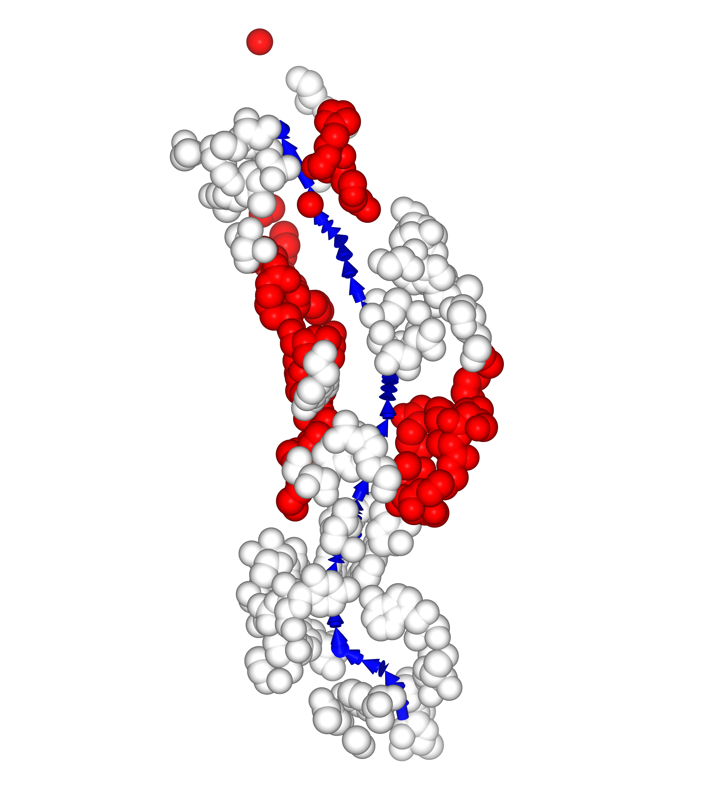
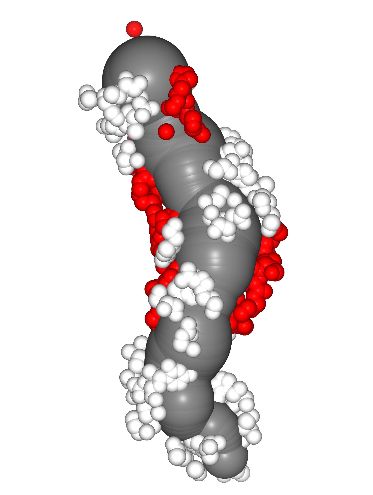
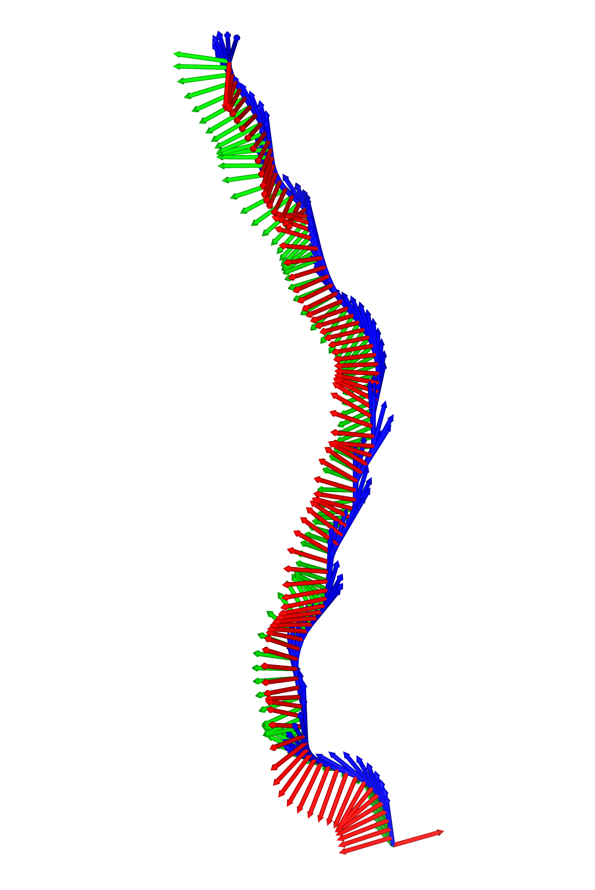
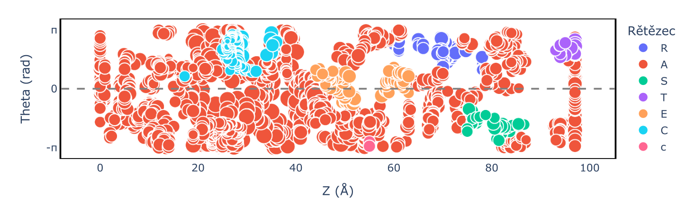

# TunnelWiz

TunnelWiz is a small Python package for **computing biomolecular tunnels** from structural data and **visualizing** the tunnel axis and tunnel-lining atoms.

It contains two modules:

- `builder` — tunnel geometry computation (axis + atom selection + coordinate transforms)
- `visual` — interactive visualization and plotting utilities

It can be installed easily via PyPi:
  ```python
  pip install tunnelwiz
  ```


## Dependencies

Core scientific stack:

- NumPy
- SciPy
- MDAnalysis

Visualization and analysis utilities:

- Pandas
- Plotly
- NGLView
- RDKit *(currently used to guess charges from a PDB; this may change in future versions)*


## Typical Pipeline

1. Load a structure using MDAnalysis:
   ```python
   import MDAnalysis as mda
   u = mda.Universe("structure.pdb")
2. Compute tunnel geometry and tunnel-lining atoms
    ```python
    atoms, cyl = construct_tunnel(u, endpoints=[10, 250], endpoint_type="resid")
3. Build a DataFrame for plotting
    ```python
    df = write_df(atoms, cyl, pdb_path="structure.pdb")
4. Visualize and plot
     ```python
    show_scatter(df, color_by="Chain")
    show_heatmap(df, value="Charge")

## Notes
Charge computation via RDKit + PDB is currently a placeholder and may change in future release. 

Selection of the tunnel-lining atoms is done by spherical selection. In future release this is intended to be improved.

## Gallery

This is the tunnel calculation process visualized







